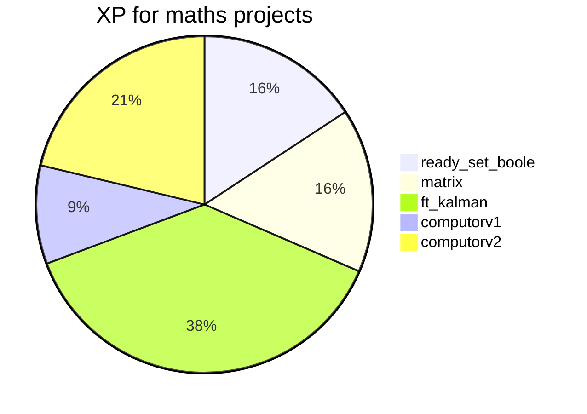
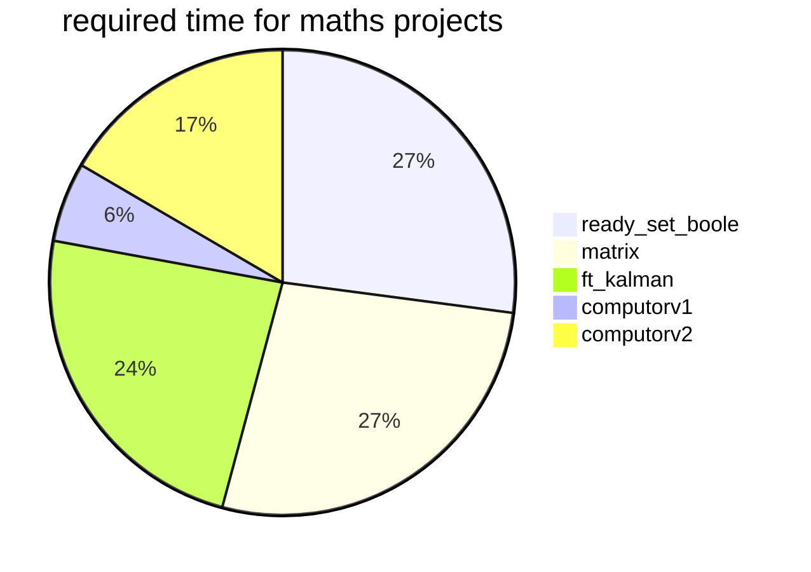
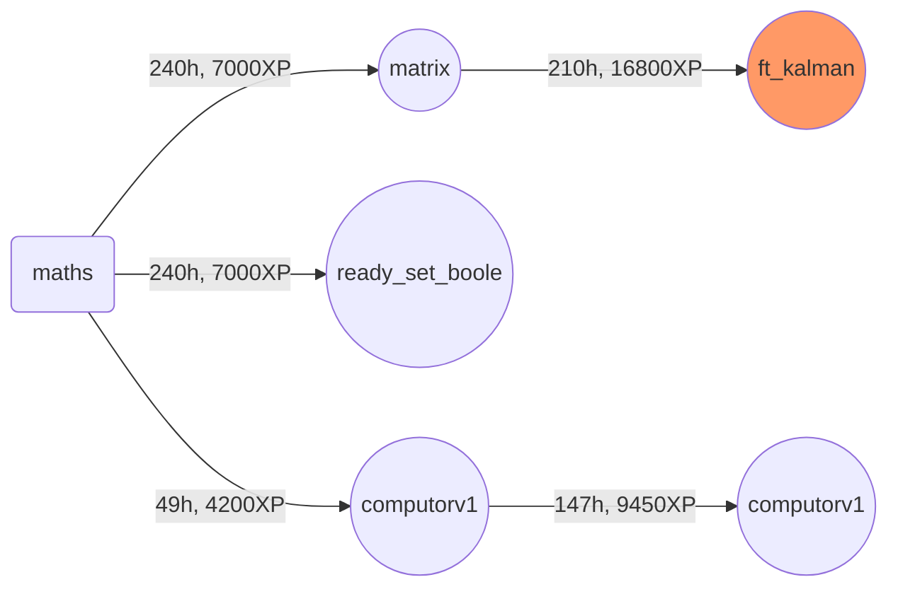

## Maths branch

<table>
<tr><th>Project</th><th>Team</th><th>Time</th><th>XP</th><th>Description</th></tr>
<tr><td>ready_set_boole <td>Solo<td>10days<td>7000<td>Discover the way computers work mathematically.</tr>
<tr><td>matrix <td>Solo<td>10days<td>7000<td>Vectors and matrices, basically.</tr>
<tr><td>ft_kalman <td>Group 1-2<td>210h<td>16800<td>For this project, you will need to create a kalman filter to retrace a trajectory with incomplete and flawed information.</tr>
<tr><td>computorv1 <td>Solo<td>49h<td>4200<td>This project is the first in a series that aims to make you rekindle with maths. They will be quite useful - not to say essential - for numerous projects to come.</tr>
<tr><td>computorv2 <td>Solo<td>147h<td>9450<td>This project is the first of a serie to renew your relationship to mathematics, it will be very useful, essential even, for many more projects.</tr>
</table>

### maths branch

